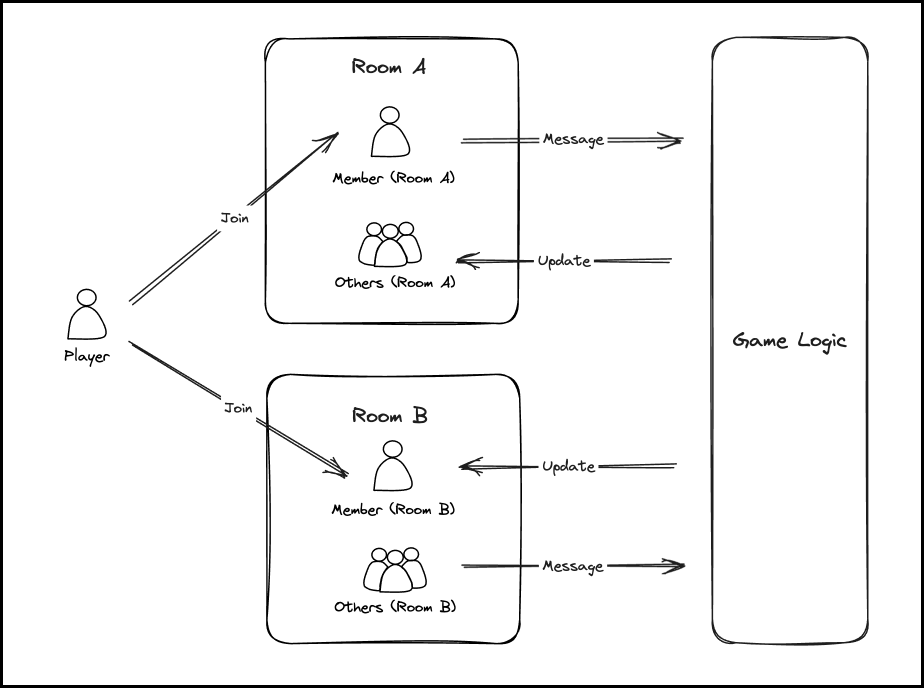

## Overview 
Multiplayer Game Communication[(EIP7566)](https://eips.ethereum.org/EIPS/eip-7566) is a multiplayer game communication (MGC) interface, using room to match and group players, and using message to process actions between players. This allows one smart contract to handle multiple players playing games on the chain, preventing centralized servers from affecting the fairness of the game.

Common multiplayer games are generally played on centralized servers. Players have no way of knowing whether there are forged data and cheating on the server. The owner of the game server can match players at will, modify scores and levels, and even close and pause the game. If the player's actions all occur on the chain, every message from the chain is proof of the player's instructions and actions, which further ensures the fairness of the game. The Multiplayer Onchain Game framework scales vertically by adding rooms to handle and accommodate multiple players. Write on-chain game logic with custom messages for horizontal expansion, allowing game developers to build multiplayer and fully on-chain games with smart contracts.   

## Features

The principle of Multiplayer Onchain Game is to use the same game logic to change the state of different groups of players. 

It consists of two core parts:

**Room**: A container for players, used to match and view connected players. The game can only be played after players join the room.

**Message**: Actions between players, using messages to perform game behaviors and change the player's state in the room.

## Usage

[Multiplayer Onchain Interface](./IMultiplayerOnchain.sol)

[Multiplayer Onchain Reference Implementation](./MultiplayerOnchain.sol)

## FAQ

### Why are multiplayer onchain games room-based?

Because the rooms are independent, each player will be assigned a new ID when entering a room. A new game round can be a room, a game task can be a room, and a game activity can be a room.

### The player's state in the game.

The game state refers to the player's data changes in the game, and `sendMessage` actually plays the role of a state converter. The proposal is very flexible, you can define some data inside the room (internal) or outside the room (global) according to the game logic.

### How to initialize player data?

You can initialize player data in `createRoom` or `joinRoom`.

### How to check and handle player exits from the game?

You can use `block.timestamp` or `block.number` to record the latest `sendMessage` time of a member. And add a message type to `sendMessage`. Other players can use this message type to complain that a member is offline and punish the member.

### Appropriate game categories.

This is a multiplayer on-chain game rather than a multiplayer real-time game. The game category depends on the network your contract is deployed on. Some layer 2 networks process blocks very quickly and can make some more real-time games. Generally, the network is more suitable for strategy, trading card, turn-based, chess, sandbox, and settlement.

## Games built with it
**[ChainChess](https://chainchess.xyz/)**  
Chain Chess is a fully onchain strategy game.
